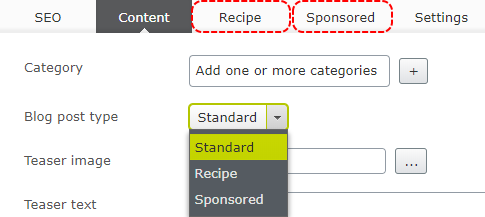
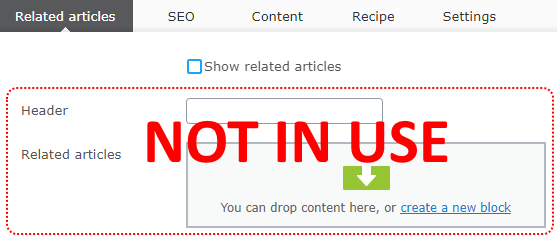

# alloy-hideTabs

HideTabs  extension that allows to programmatically hide tabs and properties in edit mode. Using this feature, the editor won’t see the unused controls when working with content.

## Hiding tabs



Using plugin you can hide tabs based on custom condition. Conditions are set on the server, without adding single line of JavaScript. To hide or show the tab based on property value you can use __ShowTabWhenPropertyEquals__ and __HideTabWhenPropertyEquals__ attributes. For the example above, for BlogPostType it will look like:

```c#
[Display(Name = "Blog post type", GroupName = SystemTabNames.Content, Order = 90)]
[SelectOne(SelectionFactoryType = typeof(BlogPostTypeSelectionFactory))]
[ShowTabWhenPropertyEquals(Global.GroupNames.Recipe, (int)BlogPostType.Recipe)]
[ShowTabWhenPropertyEquals(Global.GroupNames.Sponsored, (int)BlogPostType.Sponsored)]
public virtual BlogPostType BlogPostType { get; set; }
```

As you can see, ShowTabWhenPropertyEquals was used twice on a single property. The first attribute usage is to display Recipe tab and second to display Sponsored tab.

After running the site, tabs will be automatically displayed based on property value.

## Hiding properties

The similar situation is with the properties. Sometimes the visibility of property depends on on value of another property. For example we can have “Show related articles” checkbox. When checkbox is unchecked, the Header and “Related articles” properties are not used in view mode, and it would be good to hide them.



To hide property when value of another property changed use __ShowPropertyWhenValueEquals__ or __HidePropertyWhenValueEquals__ attribute.

```c#
[Display(Name = "Show related articles", GroupName = "Related articles", Order = 1)]
[ShowPropertyWhenValueEquals(nameof(RelatedArticlesHeader), true)]
[ShowPropertyWhenValueEquals(nameof(RelatedArticles), true)]
public virtual bool ShowRelatedArticles { get; set; }
 
[Display(Name = "Header", GroupName = "Related articles", Order = 2)]
public virtual string RelatedArticlesHeader { get; set; }
 
[Display(Name = "Related articles", GroupName = "Related articles", Order = 3)]
public virtual ContentArea RelatedArticles { get; set; }
```

You can see that ShowPropertyWhenValueEquals was used twice on one property, first time to control the visibility of RelatedArticlesHeader and second for RelatedArticles.

From now Textbox and ContentArea will be displayed only when checkbox is checked.

## More advanced scenario

The extension handles also more complex conditions when hiding tabs and properties. For example, to show a tab we have to check value of more than one property. To implement this we should use ILayoutVisibilityResolver.
We need to implement two methods:

- __GetHiddenTabs__ – get list of hidden tabs for current content
- __GetHiddenProperties__ – get list of hidden properties for current content

Of course the resolver can be used together with attribute based conditions.

```c#
using System.Collections.Generic;
using System.Linq;
using Alloy.HideTabs.LayoutVisibilityResolver;
using AlloyTemplates.Models.Pages;
using EPiServer;
using EPiServer.Core;
using EPiServer.ServiceLocation;
 
namespace AlloyTemplates.Business
{
    [ServiceConfiguration(typeof(ILayoutVisibilityResolver))]
    public class DefaultLayoutVisibilityResolver: ILayoutVisibilityResolver
    {
        public IEnumerable<string> GetHiddenTabs(IContent content)
        {
            var originalType = content.GetOriginalType();
 
            if (originalType != typeof(BlogPostPage))
            {
                return Enumerable.Empty<string>();
            }
 
            var blogPostPage = (BlogPostPage)content;
 
            List<string> hiddenTabs = new List<string>();
 
            if (blogPostPage.Text1 != "show" || blogPostPage.Text2 != "secret" || blogPostPage.Text3 != "tab")
            {
                hiddenTabs.Add("Secret");
            }
 
            return hiddenTabs;
        }
 
        public IEnumerable<string> GetHiddenProperties(IContent content)
        {
            return Enumerable.Empty<string>();
        }
    }
}
```

The “Secret” will be displayed only when 3 textboxes have specific values.
